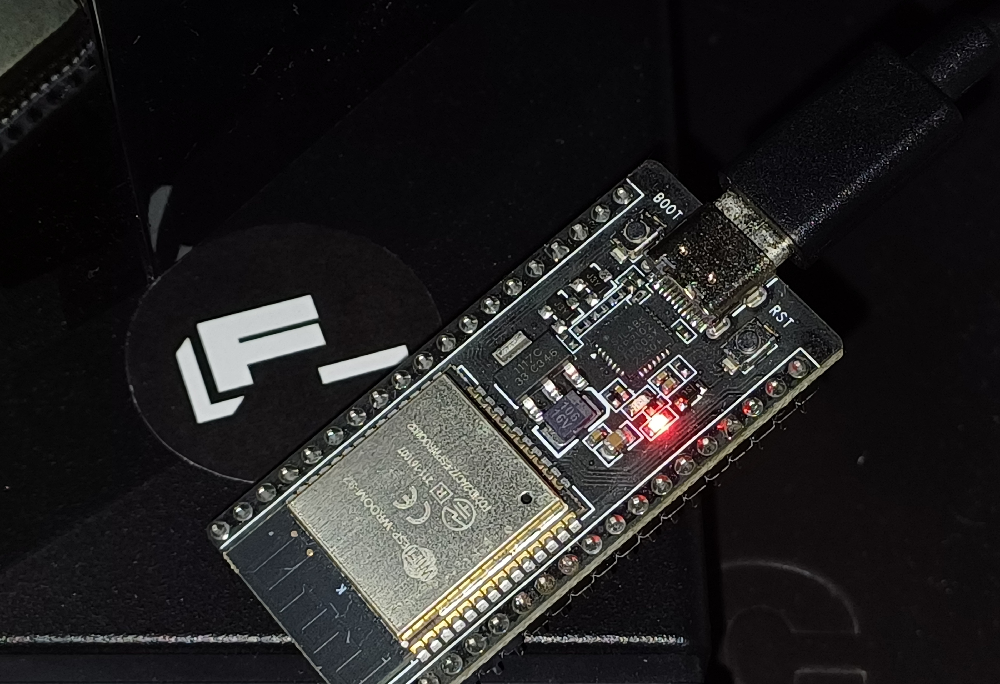

# ESP32 Webserver

I host a webserver on my ESP32 and make it accessible from the internet.

## Why ?

Hosting a webserver on an ESP32 is not a new thing, but the possibility of hosting a website on a 2cm x 5cm card is still amazing (at least for me).

> The ability to host a webserver on an ESP32 is a fascinating testament to the marvels of modern technology. It's quite astonishing to think that a tiny device, just 2cm x 5cm, can connect to the vast expanse of the internet and serve as an HTTP server. This small piece of hardware, with its immense capabilities, highlights the beauty of technological progress and the incredible potential of miniaturized devices in our interconnected world.
>
> *Author:* ChatGPT

The real reason is that it's just **fun** and kinda **stupid** to have this tiny piece of technology connected to the internet.

